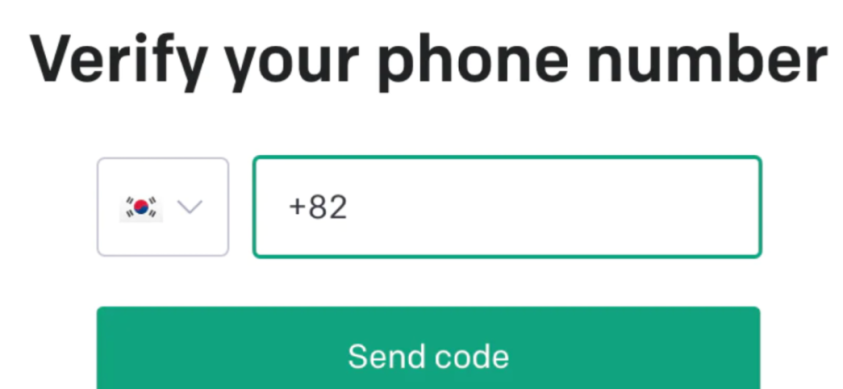

# 整理了16篇文章，让你零基础入门！带你快速上手大语言模型ChatGPT

近半年以来，大语言模型盛出不穷，特别是ChatGPT和GPT4出来之后，各家厂商就一直在大模型领域上内卷。本着白嫖大模型的想法，我这半年多以来，也一直在关注这个领域，**因此特别整理了我之前写的关于大语言模型的文章，主要围绕着OpenAI的GPT3.5和GPT4来展开。**

本文整理的资料架构主要如下，**主要分为四大板块**，希望能够为大家提供一个更全面的了解：

1.  **账号申请和充值：**
在探索大语言模型的世界之前，首先需要了解如何申请账号以及充值。这个板块将向读者详细介绍如何注册账号、选择适合自己需求的套餐，并完成充值步骤。无论是个人开发者还是企业用户，这些步骤都是踏入大模型世界的第一步。 
2.  **大模型详解：**
了解一个大模型的背后技术原理是十分重要的。在这一板块中，我将深入解析GPT-3.5和GPT-4的架构、训练方法以及核心创新点。同时也把目前主流的大模型做了简单的介绍和对比，希望读者将能够了解到这些模型是如何在处理自然语言理解和生成任务时取得突破性进展的。 
3.  **有趣的应用场景：**
大语言模型的应用领域十分广泛，从自动化客服到创意写作，从医疗诊断辅助到教育工具等等。在这一板块中，我将为大家呈现一系列有趣的应用案例，展示大模型如何在不同领域发挥作用，甚至创造出意想不到的价值。 
4.  **实操上手：**
对于许多初次接触大语言模型的人来说，实际操作可能会有一些挑战。在这个板块中，我将提供一系列实操指南，帮助读者迅速上手使用这些模型，从构建输入数据到解读输出结果，从调参优化到应对常见问题，都将有详细的步骤和建议。 

> **关注我的公众号：算法一只狗，获取全文档PDF**
> 
>

---

# 账号申请和充值
工欲善其事必先利其器，要想更好的入手ChatGPT，我们当然需要申请相关的账号。而申请成功的账号也可以进一步升级成GPT4进行使用，同时也可以调用ChatGPT的API KEY，让我们可以扩展到很多应用软件上进行使用。

1. **具体的ChatGPT账号，怎么申请可以看这篇文章**：

[ChatGPT账号申请](./账号申请和充值/ChatGPT账号申请.md)

如果实在申请不了，也可以去某宝买一个账号，几十块就有了。

1. **升级GPT4和获取有额度的API KEY，则需要进行信用卡帮顶顶，怎么申请信用卡和绑定教程可以看这里：**

[ChatGPT账号申请+充值API和Plus账号](./账号申请和充值/ChatGPT账号申请+充值API和Plus账号.md)

- **升级为ChatGPT Plus的好处**

升级为ChatGPT Plus付费版可以享受稳定性高、无字数限制、无错误等诸多好处，使得用户的使用体验更加出色。文章列举了四个步骤来完成ChatGPT Plus的升级流程。

- **实操步骤：**本质上其实是在软件上申请一个虚拟的信用卡，信用卡充值需要用到USDT货币，就在殴易平台上充值就可以了。

- **ChatGPT Plus初体验**

一旦成功开通ChatGPT Plus，用户将体验到更顺畅的AI对话体验，拥有Default和Legacy双模型回答，以及更快速、稳定的AI回复。

---

# 大模型详解
在这个板块中，主要整理了5篇文章，如果你没有太多时间看文章，可以直接浏览文章：
[GPT4详解~你感兴趣的点都在这里](./大模型详解/GPT4详解~你感兴趣的点都在这里.md)

如果对其他模型感兴趣的，可以自行浏览剩下的文章。

## [1.GPT4详解~你感兴趣的点都在这里](./大模型详解/GPT4详解~你感兴趣的点都在这里.md)

这篇文章主要简单介绍了GPT4的一些技术要点和其出色的能力：
从GPT-3.5和GPT-4对比来看，有以下几个区别：

- 在处理复杂任务上，GPT-4更可靠、更有创意，并且能够处理更细微的指令。
- 各种奥林匹克竞赛、GRE考试、代码考试、统一律师考试等测试上，GPT-4都基本完虐GPT-3.5

GPT-4在能力上的优化包括：

- 在处理复杂任务、创意和精细指令方面更可靠。
- 在学术和基准测试上表现卓越，如数学问题、法律考试等。
- 增强了视觉输入能力，能够识别图像信息。
- 具备可操纵性，可以扮演不同角色并完成任务。
- 然而，GPT-4仍存在幻觉问题，但其幻觉率较GPT-3.5降低40%。此外，OpenAI在奖励模型上加入了安全奖励信号，减少有害信息输出。

## 2.其他开源大模型介绍

1) **[《详解Claude2：一个免费好用的ChatGPT平替产品》](./大模型详解/详解Claude2：一个免费好用的ChatGPT平替产品.md)**：Anthropic推出了ChatGPT的最强平替产品Claude2，其优势在于：免费注册、文档对话能力、多语言提升等

2) **[《通义千问开源7B模型》](./大模型详解/通义千问开源7B模型.md)**：该文章介绍了开源的语言模型Qwen-7B，其具备多语言支持、8K长度上下文、优越的评测能力等优点。然而，该模型在数学能力上存在不足。

3) **[《ChatGLM重大更新：性能更加强大且节省显存》](./大模型详解/ChatGLM重大更新：性能更加强大且节省显存.md)**：本文介绍了开源的中文语言模型ChatGLM2，其为ChatGLM模型的第二代版本，在多个数据集上表现出更强的性能，支持更长的文本输入，且采用了Multi-Query Attention技术，提升了推理速度和显存占用。

- **[《主流开源大模型的正确打开方式》](./大模型详解/主流开源大模型的正确打开方式.md)**：本文总结了近期开源大模型的迭代速度加快，尤其是META开源的LLAMA2模型，推动了开源社区的发展。文中介绍了几个主流的开源大模型，并分享了使用体验，帮助初学者更快地使用这些模型

---

# 有趣的应用场景
经过上面两个板块，相信你已经了解了很多大模型的相关知识，接下来可以看到有趣的，也就是目前大模型的在一些领域上的应用，说不定可以启发你自定义自己的大模型私人助手

## 1.基于ChatGPT和其API的应用
这里可以直接在ChatGPT上进行应用，也就是简单对话的一些场景。

这里面介绍三篇主要的文章：

### 第一篇文章：[《ChatGPT它还能玩出什么花来？》](./有趣的应用场景/ChatGPT它还能玩出什么花来？.md)

本文介绍了ChatGPT在不同领域上的应用和玩法：

- 黑暗料理: 利用ChatGPT生成食谱，尝试制作出不同食材组合的料理，展示了一些有趣的创意。
- 写推理小说: 将ChatGPT用于代笔推理小说，通过提供角色和情节，让AI生成推理剧情。
- 治病救人: 利用ChatGPT诊断阿尔茨海默症，根据患者的语音特征判定病情，为早期疾病诊断提供可能性。
- 写AI文本图文生成的Prompt: 使用ChatGPT生成文本Prompt，然后将其用于生成图片的AI模型，实现了闭环创作。

### 第二篇文章，[《ChatGPT的接口开放后，一起来看看有哪些有趣好玩的应用》](./有趣的应用场景/ChatGPT的接口开放后，一起来看看有哪些有趣好玩的应用.md)

本文介绍了一些有趣的私人定制应用，利用开放的ChatGPT接口。其中包括制作真人对话系统结合Whisper语音识别、使用ChatGPT总结B站视频、开发个人微信接口调用ChatGPT等。这些创意展示了如何发挥ChatGPT在不同领域的潜力，为个人和开发者提供了新的思路和应用方向。

### 第三篇文章，[《GPT4开放API和Code Interpreter！如何利用它们来提升你的工作效率》](./有趣的应用场景/GPT4开放API和Code%20Interpreter！如何利用它们来提升你的工作效率.md)

GPT-4 API已开放，不仅企业和个人，任何人都能使用。其能力超越GPT-3.5，包括写作、翻译、数据分析等应用，但是其调用费用较高。新插件Code Interpreter可进行视频编辑、数据可视化等，加强AI在创意和实际领域的应用。

## 2.ChatGPT的其他应用场景
其他的一些研究者，则利用ChatGPT进行多场景的应用。因此这里介绍3篇文章。

### 第一篇文章，[《GPT4有趣的应用场景》](./有趣的应用场景/GPT4有趣的应用场景.md)

本文介绍了GPT-4模型在不同应用场景下的应用。

- **在编程方面，**GitHub Copilot X集成了GPT-4，提升了程序员的开发体验，包括代码编写、拉取请求管理、文档编写等功能。Cursor是一个自动代码生成工具，使用GPT-4生成代码，还能进行代码解析和问题解答。
- **在办公软件上，**微软Office产品也接入了GPT-4，称为"Microsoft 365 Copilot"，能在文档、PPT和Excel中提供智能帮助，释放创造力和提高生产力。

### 第二篇文章，[《用GPT4玩“我的世界”》](./有趣的应用场景/用GPT4玩《我的世界》.md)

本文介绍了英伟达的Voyager模型，利用GPT-4实现在《我的世界》游戏中自我驱动学习，无需微调参数。Voyager通过自动教程、技能库和迭代提示机制，执行复杂任务如战斗、挖掘等，具有终身学习和技能保存能力。模型强大且通用，为自主学习提供新思路。

### 第三篇文章，[《GPT4All运行在你的CPU上》](./有趣的应用场景/GPT4All运行在你的CPU上.md)

该文介绍了一个名为"GPT4ALL"的项目，旨在使用小模型逼近大模型（如GPT-4）效果。该项目基于Meta的LLaMA模型和GPT-4使用的数据集，使用LoRA方法进行微调。在模型对比中，与GPT-3.5和GPT-4表现相似。

---

# **实操上手**
最后一个板块，相信你已经迫不及待的要开始利用ChatGPT做一点什么了。这里面我把自己之前实现过的一些小项目介绍给大家，这些项目简单易懂，学完之后肯定能够让大家了解到ChatGPT的魅力。

## 第一篇文章，[《手把手教学！云端部署自己训练好的ChatGPT模型》](./实操上手/手把手教学！云端部署自己训练好的ChatGPT模型.md)

这篇文章教你如何利用简单的数据集，训练一个自己的ChatGPT模型。文章中主要用到Alpaca模型进行微调，最后可以部署到kaggle网站上，实现网页版部署。

## 第二篇文章，[《OpenAI开放ChatGPT的API，快来定制你的私人对话网站》](./实操上手/OpenAI开放ChatGPT的API，快来定制你的私人对话网站.md)

文章介绍了OpenAI最新开放的ChatGPT的API——“gpt-3.5-turbo”，提供了简单的代码示例来构建自己的对话机器人网站，代码只有几十行既可以完成构建。

### 第三篇文章，[《挑战不写一行代码！基于ChatGPT搭建自己的AI新闻总结工具》](./实操上手/挑战不写一行代码！基于ChatGPT搭建自己的AI新闻总结工具/readme.md)

本文介绍了如何利用ChatGPT来构建一个自动AI新闻总结工具。具体使用Selenium进行网页内容爬取，分析了目标网站的内容结构，并通过询问ChatGPT自动帮我们总结AI新闻。整个过程实现了一个闭环，无需大量手动编写代码，就能高效地将文章内容进行爬取和总结。

# 总结
本文总结了之前写的关于ChatGPT和主流大模型的文章，共16篇文章，大概3w字左右。初衷是让初学者能够快速了解和上手ChatGPT等大模型。相信读完这些文章之后，你一定会有所收获。

同时文章内容也会不定期的更新，也欢迎大家收藏点赞。我是leo，我们下期再见~

